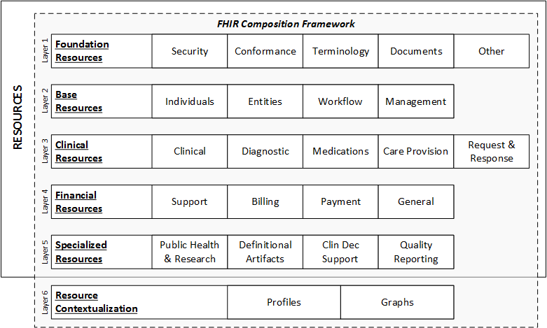

# 0. FHIR

>__HL7__
- 보건의료정보 표준협회
- HL이 정의한 표준 (V1,V2 ... CDA, FHIR) 

    __V2__	- | 구분자로 데이터 나열  
    __V3__	- 객체지향. 구조변경 어려움

>__FHIR__ :: 진료 정보 교류 프로토콜

FHIR Resource   : 모듈화된 의료정보 단위  
FHIR 메세지	    : 리소스에 실제 데이터를 담아 생성한 메세지  
FHIR 프로파일 	: 리소스를 커스텀하는 것  
FHIR 서버	    : FHIR 메세지를 보내고 받을 수 있는 서버

### __FHIR  특징__

Extensibility
- 리소스에 제약조건을 걸어 조정함
- 리소스에 추가정보를 넣을때 사용
- 리소스 기본형태를 변경하지 않는 선에서 변동성을 주는 특징

Profiling 
- 좁은 영역에 대한 규칙 적용
- ex) 혈압을 어떻게 표기


** CDM - 100개의 emr 중 공통항목만 출인 것

### __FHIR 구조__

FHIR 정보 모델 (리소스 생성 관련) 
    Base Classes: Element and Resource  
    Definitions for Base Classes: ElementDefinition and StructureDefinition  
    Data Types  
FHIR 제약 모델 
    Capability Statement  
    Profile  
FHIR 용어 (임상용어,온톨로지 ..)  
    Code System  
    Value Set  
FHIR 사용방법  
    REST API  


>__리소스__
- 대부분 리소스는 "DomainResorce" 을 구현함. 
- 한개의 리소스엔 여러개의 elements(태그,항목) 이 존재
- 각 element는 DataType(int,date..). Cardinality (항목 값의 범위) 존재
- 리소스간 참조는 각 리소스별  id 태그로 연결 (pk-fk)
  
  __coordinat__ : 코드 시스템(uri), 코드, display 3가지 기재

>[__리소스 레이어__](http://hl7.org/fhir/overview-arch.html#organizing)



1. __Foundation Resources__ : 기반 리소스. 인프라 업무에 사용. 다른 리소스로 부터 참조가 적음
2. __Base Resources__ : 기본 자원(병원, 환자). 부모 노드. 참조 되는 경우는 많으나 참조하는 경우는 적음
3. __Clinical Resources__ : 임상 관력 리소스(관찰,치료,제공약물). 2번 레이어 참조
4. __Financial Resources__ : 재정 관련 리소스(청구). 2,3번 레이더 참조(환자,임상->청구)
5. __Specialized Resources__ : 전문적 리소스. 덜 일반적인 사례 전용 리소스.
6. __Resource Contextualization__ : 프로파일 목적 리소스. 리소스의 확장, 제한, 컨텍스트화에 사용. 리소스에 포함되지 않으나, 5계층 확장함. 


>__리소스 구조 예시__

```
{
  "resourceType": "Patient",  ---------------------------  resource type
  "id" : "23434", ---------------------------------------  resource id
  "meta" : { --------------------------------------------  1. metadata
    "versionId" : "12",
    "lastUpdated" : "2014-08-18T15:43:30Z"
  }
  "text": { ---------------------------------------------  2. narrative
    "status": "generated",
    "div": "<!-- Snipped for Brevity -->"
  },
  "extension": [ ----------------------------------------  3. extensitons
    {
      "url": "http://example.org/consent#trials",
      "valueCode": "renal"
    }
  ],
  "identifier": [ ---------------------------------------  4. Elements(data)
    {
      "use": "usual",
      "label": "MRN",
      "system": "http://www.goodhealth.org/identifiers/mrn",
      "value": "123456"
    }
  ],
  "name": [
    {
      "family": [
        "Levin"
      ],
      "given": [
        "Henry"
      ],
      "suffix": [
        "The 7th"
      ]
    }
  ],
  "gender": {
    "text": "Male"
  },
  "birthDate": "1932-09-24",
  "active": true
}
```

* Resource
  * Metadata	
  * Narrative
  * Extensions
  * Elements
    * Extensions
    

1) Metadata
   - (다수 지원)리소스에 대한 디테일.
   - versionId, resourceType, lastUpdated, tag, profile ..

2) Narrative 
   - (지향) 리소스에 대해 파싱 없이 사람이 읽을 수 있는 XHTML
   - status , div

3) Extensions
   - (선택) 리소스 구조에 정의 안된 데이터를 포함할 때 사용.
   - 리소스의 추가정보. 환자 - 신분증(여권, 주민등록증) 
   - extension : {url , valueString}

4) Elements
   - (선택) 해당 리소스의 요소 = Elements = content
   - 정의된 다른 타입의 리소스들의 모음 
   - identifier , active , name, gender ....

---
>[__Restful API__](http://hl7.org/fhir/http.html) 

- 리소스에 접근할 수 있도록 지정한 URL 컨밴션

```
HTTP [base]/[resourceType]/[id] {?_format=[mime-type]}

http://hapi.fhir.org/baseR4/Patient?name=jaehoon
```

• base: 서비스 베이스 URL  
• mime-type: Mime Type  
• type: 리소스 타입  
• id: 리소스의 Logical Id  


```
Create = POST https://example.com/path/{resourceType}
Read = GET https://example.com/path/{resourceType}/{id}
Update = PUT https://example.com/path/{resourceType}/{id}
Delete = DELETE https://example.com/path/{resourceType}/{id}
Search = GET https://example.com/path/{resourceType}?search parameters...
History = GET https://example.com/path/{resourceType}/{id}/_history
Transaction = POST https://example.com/path/ (POST a transaction bundle)
Operation = GET https://example.com/path/{resourceType}/{id}/${opname}
```


